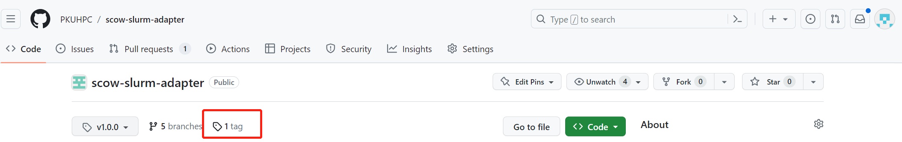
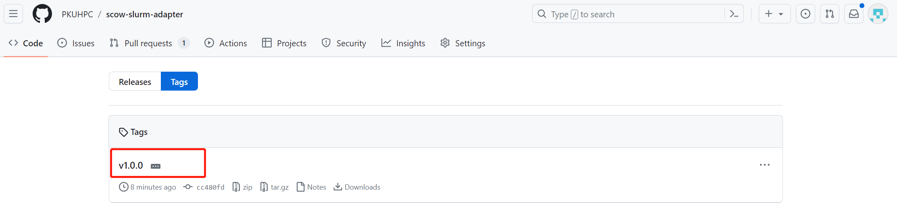
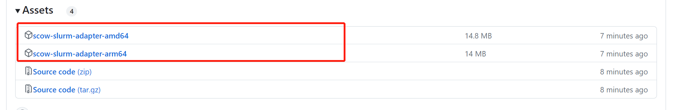

# **slurm适配器安装部署文档**


## **1 Slurm适配器生成二进制文件（直接下载、自己编译两种方式）**
### **1.1 直接下载release Slurm适配器二进制文件**
#### **1.1.1 在Slurm适配器项目地址(https://github.com/PKUHPC/scow-slurm-adapter)中点击tag标签** 

#### **1.1.2 选择最新版本tag，点击进入二进制文件下载页面**

#### **1.1.3 下载二进制文件（根据处理器架构下载对应二进制文件）**



### **1.2 下载代码编译生成二进制文件(自己编译生成二进制文件)**
#### **1.2.1 准备一台能连网的服务器或者虚拟机，在准备的服务器或虚拟机上安装go语言、配置go相关环境变量**

```bash
# 下载go语言安装包，安装go
cd download/
wget https://golang.google.cn/dl/go1.19.7.linux-amd64.tar.gz
tar -C /usr/local -xzf go1.19.7.linux-amd64.tar.gz

# 在/etc/profile中设置环境变量
export GOROOT=/usr/local/go
export GOPATH=/usr/local/gopath
export PATH=$PATH:/$GOROOT/bin:$GOPATH/bin

# source环境变量
source /etc/profile

# 验证
go version

# 设置代理
go env -w GOPROXY=https://goproxy.cn,direct

# 开启go mod管理
go env -w GO111MODULE=on
```

#### **1.2.2 在准备好的服务器或虚拟机上安装buf**
```bash
# 执行下面命令完成安装
GO111MODULE=on GOBIN=/usr/local/bin go install github.com/bufbuild/buf/cmd/buf@v1.23.1
```

#### **1.2.3 在准备好的服务器或虚拟机上拉取Slurm适配器代码**
```bash
[root@manage01]# cd /root    # 将slurm适配器代码放在root目录下
[root@manage01]# git clone https://github.com/PKUHPC/scow-slurm-adapter.git  #克隆代码
```


#### **1.2.4 生成proto文件**
```bash
# 在scow-slurm-adapter目录下执行下面命令
[root@manage01 scow-slurm-adapter]# make protos

# 执行完上面的命令后会在当前目录下生成gen目录和相关的proto文件
[root@manage01 scow-slurm-adapter]# ls gen/* 
account_grpc.pb.go  account.pb.go  config_grpc.pb.go  config.pb.go  job_grpc.pb.go  job.pb.go  user_grpc.pb.go  user.pb.go
```

#### **1.2.5 编译项目**
```bash
# 在代码根目录下执行make build生成二进制文件(scow-slurm-adapter-amd64)
[root@manage01 scow-slurm-adapter]# make build 
CGO_BUILD=0 GOARCH=amd64 go build -o scow-slurm-adapter-amd64

[root@manage01 scow-slurm-adapter]# ls
buf.gen.yaml  config  docs gen  go.mod  go.sum  main.go  Makefile  README.md  scow-slurm-adapter-amd64  tests  utils
```


## **2 配置、部署Slurm适配器**
### **2.1 将服务器上生成的可执行程序或者直接下载的二进制文件以及代码目录中的config目录拷贝至slurm管理节点的部署目录中**
```bash
# 将自己编译生成的二进制文件或者直接下载的二进制文件以及代码目录中config目录拷贝至需要部署适配器的slurm管理节点上的部署目录中
scp -r scow-slurm-adapter-amd64 config  slurm_mn:/adapter     
# slurm_mn 为需要部署适配器的slurm管理节点、/adapter目录slurm管理节点的部署目录
```

### **2.2 修改config目录下的config.yaml配置信息**
```bash

# 在slurm管理节点的部署目录/adapter中修改config目录下配置文件config.yaml的配置项
vim config/config.yaml
# slurm 数据库配置
mysql:
  host: 127.0.0.1                                         # slurmdbd服务所在服务器的ip
  port: 3306                                              # slurmdbd服务节点上数据库服务的端口
  user: root                                              # 访问slurmdbd节点数据库服务的用户名
  dbname: slurm_acct_db                                   # 指定slurm数据库的库名
  password: 81SLURM@@rabGTjN7                             # 访问slurmdbd节点数据库的密码
  clustername: cluster                                    # 指定slurm集群的名字
  databaseencode: latin1                                  # 指定数据库客户端编码

# 服务端口设置
service:
  port: 8999                                              # 指定slurm适配器服务启动端口

# slurm 默认Qos设置
slurm:
  defaultqos: normal                                      # 指定slurm默认qos信息
  # slurmpath: /nfs/apps/slurm                            # 若slurm是自定义安装路径则需要再此进行路径的配置

# module profile文件路径
modulepath:
  path: /lustre/software/module/5.2.0/init/profile.sh     # 指定module profile文件路径
```
**注意：如果slurmdbd服务不在需要部署的slurm管理节点上，在config.yaml配置文件中指定数据库配置后，还需要在slurmdbd服务所在节点为访问数据库服务的用户授权（只读权限select）。**

### **2.3 启动slurm适配器**
```bash
# slurm适配器二进制文件和config目录需在同一目录（部署目录）下
[root@slurm_mn]# ls /adapter
config scow-slurm-adapter-amd4

# 给二进制添加执行权限
# 在slurm管理节点上启动服务
[root@slurm_mn]# chmod +x /adapter/scow-slurm-adapter-amd64

# 在slurm管理节点上启动服务
[root@slurm_mn]# cd /adapter && nohup ./scow-slurm-adapter-amd64 > server.log 2>&1 &     # 适配器启动后会在部署目录生成一个server.log的日志文件
```


## **运维Slurm适配器**
### **3.1 查看Slurm适配器进程**
```bash
# 在Slurm适配器部署服务器上运行下面命令
ps aux | grep [s]cow-slurm-adapter-amd64  # 如果有输出则Slurm适配器进程存活、无输出则Slurm适配器终止
```

### **3.2 查看日志信息**
```bash
# 在部署目录中查看server.log文件,分析日志信息
less /adapter/server.log
```

## **4 更新Slurm适配器**
### **4.1 下载最新版的Slurm适配器二进制文件**
* 在slurm适配器github项目地址中下载最新的二进制文件（参考本文档1.1节的内容）
* 将下载的最新的二进制文件拷贝值需部署适配器的slurm管理节点
* 在slurm管理节点上停止Slurm适配器的运行
  ```bash
  ps -ef | grep [s]cow-slurm-adapter-amd64 | awk '{print $2}' | xargs kill -9
  ```
* 在slurm管理节点的部署目录中修改config/config.yaml文件（详细参考2.2节信息）（config目录需和Slurm适配器二进制文件放在同一个目录下）
* 在Slurm管理节点上启动最新的Slurm适配器
    ```bash
    nohup ./scow-slurm-adapter-amd64 > server.log 2>&1 &
    ```

### **4.2 更新代码自己编译生成最新的Slurm适配器二进制文件**
* 更新代码
  ```bash
  # 在2.1节中Slurm适配器代码目录中执行git pull 拉取最新代码
  [root@manage01 scow-slurm-adapter]# git pull  #拉取最新代码
  ```
* slurm 管理节点上停止Slurm适配器进程
  ```bash
  # slurm 管理节点上执行以下命令, 停止Slurm 适配器进程
  ps -ef | grep [s]cow-slurm-adapter-amd64 | awk '{print $2}' | xargs kill -9
  ```
* 编译节点上重新执行本文档2.2节内容，生成新的proto文件
* 编译节点上重新执行本文档2.3节内容，编译生成新的适配器可执行程序
* 执行本文档第3章的内容，完成Slurm适配器的部署更新

